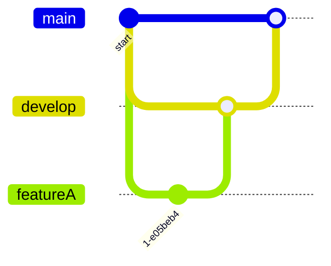

# Branch Workflows

## Git Flow

Een populaire strategie:  
- `main` = stabiele code  
- `develop` = integratiebranch  
- `feature/*` = nieuwe functies  
- `hotfix/*` = snelle fixes

---

## Oefeningen

1. Simuleer Git Flow met een klein project.  
2. Maak een feature branch, commit, en merge terug in develop.  
3. Release naar main.
