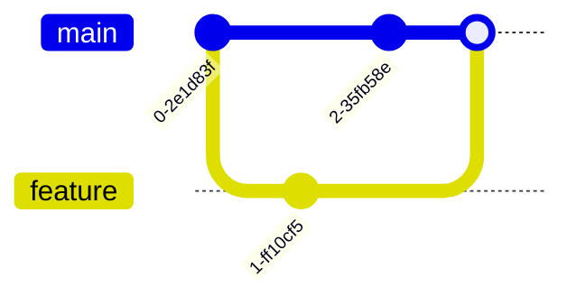

# Merge Conflicts

Een merge conflict ontstaat wanneer twee personen dezelfde lijn code wijzigen.

Git weet niet welke versie te behouden en vraagt jou dit manueel op te lossen.

## Conflict oplossen

1. Open het bestand met conflict.  
2. Zoek naar markeringen `<<<<<<<`, `=======`, `>>>>>>>`.  
3. Kies de juiste inhoud en verwijder de markeringen.  
4. Maak een nieuwe commit.

---

## Oefeningen

1. Werk in duo: beide wijzigen dezelfde lijn.  
2. Probeer te pushen en los het conflict op.  
3. Commit de oplossing.
