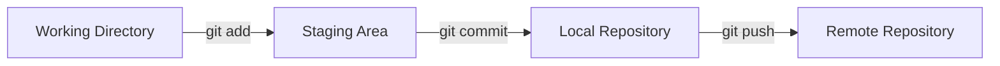

# Stage, Commit & Push

Git werkt in drie zones: **working directory**, **staging area**, en **repository**.



## Stage

Met `git add` voeg je bestanden toe aan de staging area.  
```bash
git add bestand.txt
git add .   # alles toevoegen
```

## Commit

Een commit is een snapshot van je project.  
```bash
git commit -m "Voeg nieuw bestand toe"
```

!!! tip
    Schrijf duidelijke commit messages. Vermijd “update” of “fix”.

## Push

Met `git push` stuur je je commits naar de remote repo.  
```bash
git push origin main
```

---

## Oefeningen

1. Maak een bestand en voeg het toe met `git add`.  
2. Commit het bestand met een duidelijke boodschap.  
3. Push de commit naar GitHub (maak eerst een remote repo aan).
