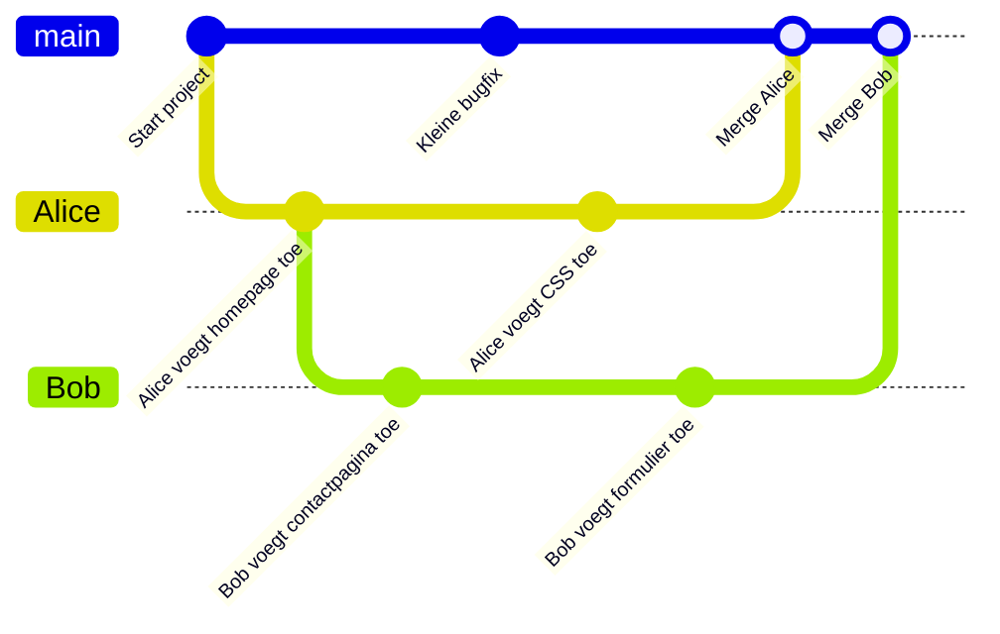

# 👋 Welkom

## Introductie tot Git

Welkom bij de **Git-cursus** van Multimedia & Creative Technology!
In deze cursus leer je stap voor stap werken met Git, hét versiebeheersysteem dat wereldwijd de standaard is geworden voor softwareontwikkeling en samenwerking.

---

## Waarom Git?

Om te begrijpen waarom Git zo belangrijk is, kijken we eerst even terug naar **hoe het vroeger ging**.

### Werken zonder versiebeheer

In de begindagen van softwareontwikkeling (en eigenlijk ook bij gewoon documentbeheer) werd vaak gewerkt volgens het principe:

- Je had één **hoofdbestand**.
- Wanneer je iets wilde aanpassen, **overschreef** je het bestand.
- Wilde je een oude versie bewaren? Dan maakte je een **kopie** met een naam zoals:
    - project_final.doc
    - project_final_v2.doc
    - project_final_v2_reallyFINAL.doc

Dit leidde tot allerlei problemen:

- **Verlies van werk**: Oeps, je hebt per ongeluk iets overschreven dat je later toch nodig had.
- **Chaos in versies**: Welke versie was nu eigenlijk de juiste?
- **Samenwerken was moeilijk**: Als twee mensen tegelijk aan hetzelfde bestand werkten, moest iemand later alles **handmatig samenvoegen**.

---

## De komst van versiebeheersystemen

Om deze problemen op te lossen, ontstonden versiebeheersystemen zoals **CVS**, **Subversion (SVN)** en uiteindelijk **Git**.

Met Git krijg je:

- **Versiegeschiedenis**
  Elke wijziging wordt bewaard. Je kan altijd terug naar een vorige versie.

- **Samenwerken zonder chaos**
  Meerdere mensen kunnen tegelijk aan hetzelfde project werken zonder elkaars werk te overschrijven.

- **Experimenteren zonder risico**
  Dankzij *branches* kan je nieuwe ideeën uitproberen, zonder het stabiele project in gevaar te brengen.

- **Traceerbaarheid**
  Je weet altijd **wie** iets heeft aangepast, **wat** er veranderd is, en **wanneer** dat gebeurde.

---

## Hoe ziet dat er in de praktijk uit?

Stel: je werkt met drie teamleden aan een website.

- Vroeger:
  Iedereen mailt elkaar bestanden heen en weer, en iemand moet alles manueel samenplakken. Resultaat: frustratie, fouten en verloren tijd.

- Met Git:
  Iedereen werkt in zijn eigen "kopie" (branch) en kan zijn werk **samenvoegen** (*merge*) met dat van de anderen. Conflicten worden automatisch opgespoord en zijn overzichtelijk op te lossen.

